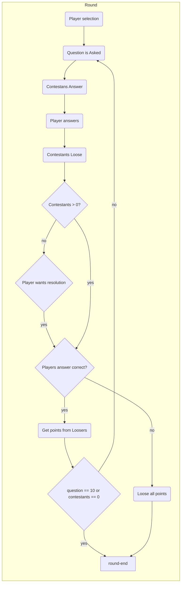

# 1-gegen-100

Party game variant of the 1 vs 100 gameshow.

## Terms

This software needs some standart terms

contestants -> All players that play against the challenger
challenger -> one player that plays against the contestants

## Round Logic

